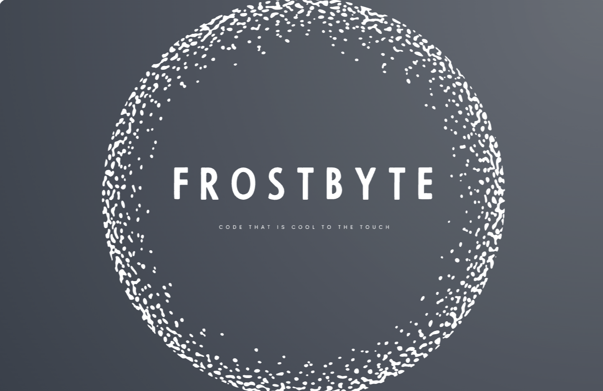
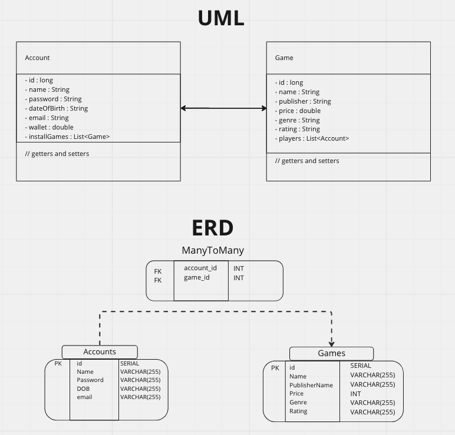

<H1 align="center">FrostByte Game Launcher</H1>

---

## Project Description


A game launcher is an integral part of the gaming experience, serving as a bridge between the user and the games they know and love. This launcher will hold different user accounts and their respective collections of games, as well as a game library filled with many games that are out there in the world. 

These technologies are **vital** to run this application:

| Technology  | Version |
|-------------|---------|
| Java        | 17      |
| Spring Boot | 2.7.6   |
| PostgreSQL  | 14.5    |

---
## Installation Instructions

Follow these steps to get started with the FrostByte application:

1. Ensure you have at least [Java 17](https://www.oracle.com/uk/java/technologies/downloads/#jdk17) installed
2. If you have HomeBrew installed, use the following line to install PostgreSQL:
```
$ brew install postgresql
```
Otherwise, install it from [here](https://www.postgresql.org/download/)

3. To access this application, you can clone this repository using the terminal on your system using:
```
$ git clone https://github.com/wjstanistreet/FrostByte_game_launcher.git
```
4. Create a database called 'gameLauncherDB'
```
$ createdb gameLauncherDB
```
You should now be able to run FrostByte!

---

## Project Aims

The FrostByte launcher is able to do the following:
- Create an account for a new user
- Show user profile details for an existing account
- Update user information for an existing account
- Delete an existing user account 
- Add a game from the Game library to the user's account
- Show the games existing in the game library
- Connect the accounts to the games they own

The key classes and their database relationships can be viewed in this UML diagram and ERD:



---

## Example Routes

These are some example routes that our API can provide. This is not an exhaustive list, so check out the controllers to see what you can do!

### Account:

| **Route**   | **Request Type** | **Request Body** (as JSON) | **Description** | **Output** |
|---------------------------|------------------|------------| -------------------|------------------------|
| /accounts   | GET              | | Read all accounts |[ { </br> "id": 1, </br> "name": "Account Name", </br> "password": "12345", </br> "dateOfBirth": "01/01/1992", </br> "email": "account1@email.com", </br> "wallet": 0, </br> "friends": [], </br> "installGames": [] </br> }, </br> { </br> "id": 2, ... |
| /accounts/1 | GET | | Read account by id | { </br> "id": 1, </br> "name": "Account Name", </br> "password": "12345", </br> "dateOfBirth": "01/01/1992", </br> "email": "account1@email.com", </br> "wallet": 0, </br> "friends": [], </br> "installGames": [] </br> } |
| /accounts | POST | { </br> "name": "Account Name", </br> "password": "12345", </br> "dateOfBirth": "01/01/1992", </br> "email": "account1@email.com" </br> }| Create a new account | { </br> "id": 1, </br> "name": "Account Name", </br> "password": "12345", </br> "dateOfBirth": "01/01/1992", </br> "email": "account1@email.com", </br> "wallet": 0, </br> "friends": [], </br> "installGames": [] </br> } |
| /accounts/1 | PATCH  | { </br> "name": "New Account Name", </br> "password": "12345", </br> "dateOfBirth": "01/01/1992", </br> "email": "account1@email.com" </br> } | Update an existing account | { </br> "id": 1, </br> "name": "New Account Name", </br> "password": "12345", </br> "dateOfBirth": "01/01/1992", </br> "email": "account1@email.com", </br> "wallet": 0, </br> "friends": [], </br> "installGames": [] </br> } |
| /accounts/1 | DELETE  | | Delete an existing account |  |
| /accounts/1 | PUT  | { </br> "gameId": 21 </br> } | Add a game to an account | { </br> "message": "Purchase successful: Enjoy the game!", </br> "accountStatus": { </br> "id": 1, </br> "name": "Account Name", </br> "password": "12345", </br> "dateOfBirth": "01/01/1992", </br> "email": "account1@email.com", </br> "wallet": 0, </br> "friends": [], </br> "installGames": [ </br> {  </br> "id": 21, </br> "name": "SpiderMan ps4" </br> "publisher": "Bryan Intihar", </br> "price": 64.99, </br> "genre": "Open World", </br> "ageRating": "16" </br> }] </br> }|


### Game:

| **Route**   | **Request Type** | **Description** | **Output** |
|-------------------------|----------------| -------------------|------------------------|
| /games   | GET               | Read all games | [{ </br> "id": 1, </br> "name": "God Of War", </br>   "publisher": "Corey Barlog", </br> "price": 30.0, </br> "genre": "Fantasy", </br> "ageRating": "18", </br> "players": [] </br> }, </br> { </br> "id": 2, ...|
| /games/1 | GET  | Read game by id |  { </br> "id": 1, </br> "name": "God Of War", </br>   "publisher": "Corey Barlog", </br> "price": 30.0, </br> "genre": "Fantasy", </br> "ageRating": "18", </br> "players": [] </br> }|
| /games?ageRating=3 | GET  | Read all games through ageRating filter | { </br> "id": 5, </br> "name": "Forza Horizon", </br> "publisher": "Bill Gates", </br> "price": 68.99, </br> "genre": "Racing", </br> "ageRating": "3", </br> "players": [] </br> }, </br> { </br> "id": 6, ...|
| /games?ageRating=18&genre=Action | GET | Read all games through ageRating and genre filter | [ </br> { </br> "id": 3, </br> "name": "Devil May Cry", </br> "publisher": "Hideaki Itsuno", </br> "price": 50.0, </br> "genre": "Action", </br> "ageRating": "18", </br> "players": [] </br> }, </br> { </br> "id": 6,  ...|


---

## Extensions

- Have a wallet that allows user to buy a game and add the game to their account
- Allow user to filter game library using specific parameters
---
## Further Extensions

- [x] Create friend list property and implement relationship ~ Branch: friendslist
- [x] Create Achievement class and implement in Account and Game class ~ Branch: friendslist
- [ ] Implement RESTful functions for friends list and achievements
- [ ] Develop filters to view games in common with friends
- [ ] Add properties to Game and Account for further customisation, e.g. Account photos and Box art

